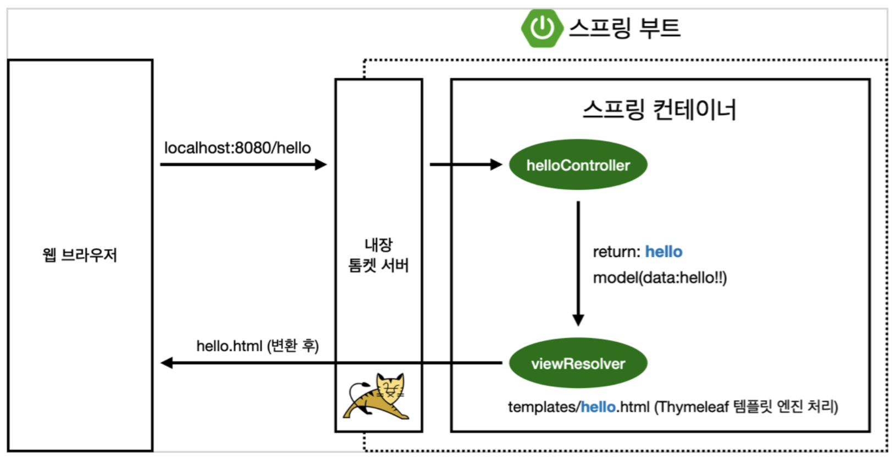

# 스프링 부트 초기설정시작.

    - 프로젝트 선택 (Maven, Gradle) * 최근엔 Gradle을 많이 사용함.
    - Dependencies(어떤 라이브러리를 사용할것인지) 선택
        - Spring Web (웹개발을 할것이므로 선택)
        - Thymeleaf (템플릿 엔진)
        - Lombok (Getter, Setter, toString 등을 쉽게 사용하기위한 라이브러리)
    - Generate 선택 -> 다운로드 시작 -> 인텔리제이에서 오픈(build.gradle) -> 자동으로 라이브러리 설치가 진행됨.

## 인텔리제이에서 진행

    - src폴더 속 main폴더와 test폴더가 생성
        - main폴더 -> 실제 사용되는 코드들
        - test폴더 -> 테스트를 위해 사용되는 코드들
        - resources -> 자바 파일들의 실행을 위한 설정파일들이 존재함.

    - build.gradle -> gradle 설정에 관련된 정보들이 들어가있음.
        - dependencies{} 사이에 내가 설정한 라이브러리들이 들어가있음.(mavenCentral에서 자동다운)

    - HelloSpringApplication 실행 후 http://localhost:8080 사이트 접속 여부 확인(스프링 정상작동 체크)

### 스프링 부트 라이브러리

    - spring-boot-starter-web
        - spring-boot-starter-tomcat : 웹서버 구동을 위한 톰캣파일
        - spring-webmvc : 스프링 웹 MVC
    - spring-boot-start-thymeleaf : 타임리프 템플릿 엔진(view)
    - spring-boot-starter(공통) : 스프링 부트 + 스프링 코어 + 로깅
        - spring-boot
            - spring-core
        - spring-boot-starter-logging
            - logback, slf4j ...

### 테스트 라이브러리

    - junit : 테스트 프레임워크
    - mockito : 목(mock) 라이브러리
    - assertj : 테스트코드를 좀 더 편하게 작성하게 도와주는 라이브러리
    - spring-test : 스프링 통합 테스트를 지원.

### Welcome page ( 서버 접속시 최초 표시되는 페이지 )

    - scr/main/resources/static/index.html



```
@GetMapping("hello")   //url값이 /hello로 넘어왔을때 (Get 방식)
public String hello(Model model) { //스프링에서 Model을 생성

    model.addAttribute("data", "hello!!"); //model에 data(key) 값으로 hello!!를 전달
    return "hello"; // templates에 hello.html을 찾아서 자동으로 리턴(스프링이 처리해줌)
}
```

    - 컨트롤러에서 리턴 값으로 문자를 반환하면 뷰 리졸버( viewResolver )가 화면을 찾아서 처리한다.
        - 스프링 부트 템플릿엔진 기본 viewName 매핑
        - resources:templates/ +{ViewName}+ .html

        - 참고: spring-boot-devtools 라이브러리를 추가하면, html 파일을 컴파일만 해주면 서버 재시작 없이 View 파일 변경이 가능하다.
            - 인텔리J 컴파일 방법: 메뉴 build

- 빌드하고 실행하기
  - 빌드할 폴더로 터미널 이동
  - 터미널 명령어 ( ./gradlew build) ->build/libs 폴더내에 빌드된 파일 .jar 생성
  - 터미널에서 java -jar '파일명' 으로 실행히 빌드된 파일 실행가능.
